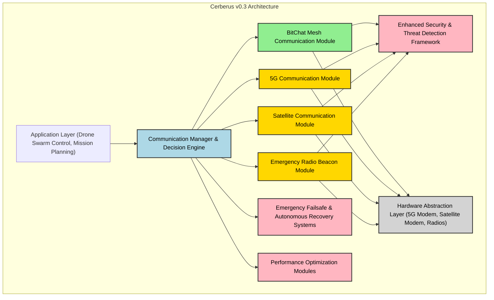

# High-Level Architectural Overview: Cerberus v0.3 on BitChat Codebase

This document provides a high-level architectural overview of how the Cerberus v0.3 Hybrid 5G/Mesh Architecture could be realized, leveraging the BitChat codebase as a foundational component for its mesh communication capabilities.

## 1. Core Principle: Multi-Modal Adaptive Communication

Cerberus v0.3 moves beyond a simple binary switch between 5G and mesh. Its central tenet is an **Adaptive Multi-Modal Communication Fabric** that intelligently selects and orchestrates various communication channels (Mesh, 5G, Satellite, Emergency Radio Beacon) based on real-time conditions such as signal quality, security posture, mission phase, and detected threats. This dynamic adaptation is managed by a new, overarching **Communication Manager/Decision Engine**.

## 2. BitChat's Role: The Robust Mesh Core

BitChat, with its existing capabilities, would serve as the **primary Mesh Communication Module** within the Cerberus architecture. Its strengths directly align with the requirements for a secure, decentralized, and peer-to-peer mesh network:

*   **Bluetooth LE Mesh Networking:** BitChat's established multi-hop relaying over Bluetooth LE forms the backbone of the mesh component, enabling communication in environments without traditional infrastructure.
*   **Privacy and Cryptography:** BitChat's use of the Noise Protocol for end-to-end encryption and its privacy-first design (no accounts, no phone numbers) are critical for maintaining a high security posture within the mesh. This cryptographic foundation can be extended to support Cerberus's layered encryption and secure relaying.
*   **Modular Foundation:** BitChat's existing modular structure (Identity, Models, Protocols, Services) provides a solid base upon which to build enhancements for intelligent multi-hop relaying and mesh-specific threat detection.

## 3. New Core Components for Cerberus v0.3

To achieve the full vision of Cerberus v0.3, several significant new architectural components would need to be developed and integrated alongside BitChat:

### 3.1. Communication Manager & Decision Engine (Orchestration Layer)

This is the central intelligence of Cerberus. It would be a new, high-level software layer responsible for:

*   **Mode Selection:** Dynamically choosing the optimal communication mode (Mesh, 5G, Satellite, Emergency) based on inputs from various sensors and threat assessments.
*   **Predictive Connectivity Mapping:** Utilizing GPS, flight vectors, terrain analysis, and historical data to anticipate connectivity changes and initiate proactive mode transitions.
*   **Seamless Switching Protocol:** Managing secure and graceful transitions between communication modes, including overlap periods and verification steps to ensure message delivery and maintain security.
*   **Configuration Management:** Adapting communication parameters (e.g., encryption levels, relay hops, traffic obfuscation) based on the selected mode and operational environment.

### 3.2. Multi-Modal Protocol Handlers & Hardware Abstraction Layers

Beyond BitChat's Bluetooth LE capabilities, Cerberus requires integration with other communication technologies. This necessitates new modules for each:

*   **5G Module:** Handles communication over 5G networks, including hardened security measures like IMSI privacy, base station authentication, double encryption, and traffic obfuscation. This module would interface with 5G modems.
*   **Satellite Module:** Manages communication via LEO/GEO satellite networks, interfacing with satellite modems.
*   **Emergency Radio Beacon Module:** Implements a robust, hard-to-jam radio beacon protocol for critical communication during blackouts, interfacing with specialized radio hardware.

Each of these modules would have its own protocol handlers, security layers, and hardware abstraction layers to manage the specific complexities of their respective technologies.

### 3.3. Enhanced Security & Threat Detection Framework

While BitChat provides a cryptographic base, Cerberus requires a more comprehensive security framework:

*   **5G-Specific Threat Detection:** Modules to detect and respond to threats unique to 5G, such as IMSI catchers, fake base stations, and protocol downgrade attacks.
*   **Intelligent Multi-Hop Relay Security:** Enhancements to BitChat's mesh layer to implement 

Proof-of-Relay protocols and dynamic path selection based on trust scores.
*   **Centralized Threat Intelligence:** A system to aggregate threat data from all communication modules and trigger appropriate responses, including mode switching or defensive postures.

### 3.4. Emergency Failsafe & Autonomous Recovery Systems

These systems are crucial for maintaining operational capability under extreme conditions:

*   **Communication Blackout Protocols:** Logic to detect complete communication loss and activate emergency beacon modes (e.g., simplified, hard-to-jam radio transmissions).
*   **Autonomous Recovery Logic:** Algorithms for self-healing networks, automatic topology reconfiguration, and decision trees for autonomous actions like Return-to-Launch (RTL) or mission abort based on battery, threats, and communication status.

### 3.5. Performance Optimization Modules

To ensure efficient and reliable communication:

*   **Bandwidth Management:** Intelligent traffic shaping to prioritize critical messages (e.g., flight commands over sensor data) and dynamically allocate bandwidth across available channels.
*   **Latency Optimization:** Techniques like multi-path concurrent transmission (sending critical messages over multiple paths simultaneously) and predictive path pre-establishment (setting up connections before they are needed) to minimize communication delays.

## 4. High-Level Architecture Diagram

## 4.1 Complete Architecture Diagram

```mermaid
graph TD
    subgraph " "
    %% Top Level: Simulation Entry Points
    subgraph "Application & Simulation Layer"
        direction LR
        Runner["<b>run_simulations.sh</b><br><i>Interactive Runner</i>"]
        Sim1["main_communication_manager_simulation.py"]
        Sim2["main_mesh_simulation.py"]
        Sim3["main_5g_simulation.py"]
        Sim4["main_advanced_communication_simulation.py"]
        Sim5["main_testing_operationalization_simulation.py"]
    end

    %% Core Orchestration Layer
    subgraph "Orchestration & Decision Layer"
        CommManager["<b>CommunicationManager</b><br><i>(communication_manager.py)</i><br>The central brain; selects comms mode."]
    end

    %% Communication Modes
    subgraph "Communication Modes (Managed by CommunicationManager)"
        direction LR
        
        %% 5G Module and its specific dependencies
        subgraph "Secure 5G Stack"
            Secure5G["<b>Secure 5G Module</b><br><i>(secure_5g_module.py)</i>"]
            subgraph G5Security["5G Security Components (security/)"]
                direction TB
                IMSI["IMSI Privacy"]
                BSAuth["Base Station Auth"]
                CarrierVal["Carrier Validation"]
                DoubleEnc["Double Encryption"]
                TrafficOb["Traffic Obfuscation"]
            end
            Secure5G -. Uses .-> G5Security
        end

        %% Mesh Module conceptual group
        subgraph "Enhanced Mesh Stack (BitChat-Inspired)"
            MeshModule["<b>Enhanced Mesh Module</b><br><i>(Conceptual)</i>"]
            subgraph MeshComponents["Mesh Security & Routing"]
                direction TB
                Onion["Onion Routing<br><i>(onion_routing.py)</i>"]
                PoR["Proof of Relay<br><i>(proof_of_relay.py)</i>"]
                RPM["Relay Path Manager<br><i>(relay_path_manager.py)</i>"]
            end
            MeshModule -. Composed of .-> MeshComponents
        end

        %% Advanced/Fallback Modules
        subgraph "Advanced & Emergency Modules"
            SatComm["<b>Satellite Module</b><br><i>(satellite_communication.py)</i>"]
            Beacon["<b>Emergency Beacon</b><br><i>(emergency_beacon.py)</i>"]
        end
    end

    %% System-Wide Services (Consulted by Orchestration Layer)
    subgraph "System-Wide Services & Protocols"
        direction LR

        subgraph "Unified Threat Detection (security/)"
            UTD["<b>UnifiedThreatDetector</b>"]
            G5Detector["G5ThreatDetector"]
            MeshDetector["Mesh Anomaly Detector<br><i>(Conceptual)</i>"]
            UTD -- Consolidates --> G5Detector
            UTD -- Consolidates --> MeshDetector
        end

        subgraph "Autonomous Protocols (protocols/)"
            AutoRecovery["<b>Autonomous Recovery</b><br>Decision Tree"]
            Blackout["<b>Communication Blackout</b><br>Detection"]
            PerfOpt["<b>Performance Optimization</b><br>Traffic Shaping"]
        end
    end

    %% External Frameworks for Testing and Ops
    subgraph "Testing & Operationalization Frameworks"
        direction LR
        Testing["<b>Security Testing</b><br><i>(testing/security_testing_framework.py)</i>"]
        Operational["<b>Operational Procedures</b><br><i>(operational/operational_procedures.py)</i>"]
    end
    end

    %% Defining Relationships between all components

    %% Simulations trigger core components
    Runner --> Sim1 & Sim2 & Sim3 & Sim4 & Sim5
    Sim1 --> CommManager
    Sim2 --> MeshModule
    Sim3 --> Secure5G & G5Detector
    Sim4 --> UTD & AutoRecovery & Blackout & SatComm & Beacon
    Sim5 --> Testing & Blackout & AutoRecovery

    %% Manager controls all communication modes
    CommManager -- Manages & Chooses --> Secure5G
    CommManager -- Manages & Chooses --> MeshModule
    CommManager -- Manages & Chooses --> SatComm
    CommManager -- Manages & Chooses --> Beacon

    %% Manager uses system-wide services
    CommManager -- Consults --> UTD
    CommManager -- Triggers --> AutoRecovery
    CommManager -- Uses --> PerfOpt

    %% Protocol interactions
    AutoRecovery -- Uses Status from --> Blackout
    Blackout -- Activates on Failure --> Beacon

    %% Testing Framework acts on the system
    Testing -- Adversarially Tests --> Secure5G & MeshModule

    %% Styling
    style Runner fill:#D2B4DE,stroke:#333,color:#000
    style CommManager fill:#ADD8E6,stroke:#333,stroke-width:4px,color:#000
    style Secure5G fill:#90EE90,stroke:#333,color:#000
    style MeshModule fill:#90EE90,stroke:#333,color:#000
    style SatComm fill:#F0E68C,stroke:#333,color:#000
    style Beacon fill:#FFA07A,stroke:#333,color:#000
    style UTD fill:#FFB6C1,stroke:#333,color:#000
    style AutoRecovery fill:#FFB6C1,stroke:#333,color:#000
    style Blackout fill:#FFB6C1,stroke:#333,color:#000
    style PerfOpt fill:#FFB6C1,stroke:#333,color:#000
    style Testing fill:#A9A9A9,stroke:#333,color:#000
    style Operational fill:#A9A9A9,stroke:#333,color:#000
```

## 5. Conclusion

Cerberus v0.3 represents a sophisticated, multi-layered communication system. While BitChat provides an excellent, privacy-focused foundation for the mesh networking component, the overall architecture necessitates substantial new development. This includes a central decision engine to orchestrate communication modes, new modules for 5G, satellite, and emergency radio, and comprehensive security, failsafe, and performance optimization layers. The integration would involve building a robust system around BitChat's core mesh capabilities, rather than simply extending BitChat itself.

